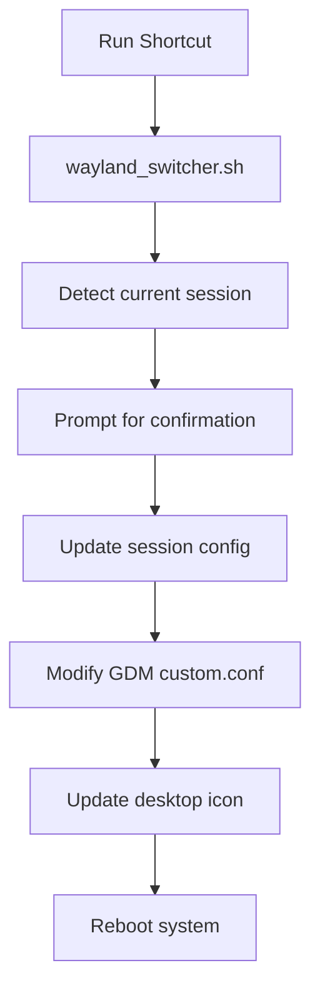

# 🖥️ Wayland Switcher (for Ubuntu)

Seamlessly toggle between **Wayland** and **Xorg** sessions on Ubuntu — with a simple desktop shortcut.

## 🚀 About

This project was born out of a common annoyance.

Switching between Wayland and Xorg isn't hard… but it’s not exactly user-friendly either. I wanted a **clickable** solution — no digging through login screens or config files every time.

So I built **Wayland Switcher**:

- 🎯 Toggle sessions directly from your desktop
- 🔄 Automatically updates session files and icon state
- 🧼 Clean uninstall with one command

It’s lightweight, dead simple, and actually useful.

---

## 🛠️ Features

- Click to switch between Wayland and Xorg
- Icon changes to reflect the active session
- Applies changes system-wide (via GDM config)
- Cleanly reboots into the new session
- Includes uninstall option to remove all traces

---

## 📦 Installation

1. Clone the repo:
   ```bash
   git clone https://github.com/yourusername/wayland-switcher.git
   cd wayland-switcher
   ```

2. Run the installer script:
   ```bash
   chmod +x WaylandSwitcher_AutoInstaller.sh
   ./WaylandSwitcher_AutoInstaller.sh
   ```

3. Follow the prompts:
   - Choose where to install
   - Your desktop switcher will be created 🎉

---

## 🔧 Recommended Setup

- 📌 **Pin to your dock** for one-click switching
- 🔒 Make sure you’re in the `sudoers` group — the script needs `sudo` to modify session files

---

## 🖱️ Usage

- Run the desktop shortcut named **"Wayland Switcher"**
- See current session, confirm switch
- System reboots into selected mode
- Desktop icon reflects new state

---

## 🧹 Uninstall

To remove everything:
```bash
./WaylandSwitcher_AutoInstaller.sh --uninstall
```

This deletes:
- The desktop shortcut
- All related scripts and icons

---

## 🧬 How It Works



---

## 📁 Directory Structure

```bash
~/Wayland Switcher/
├── wayland_switcher.sh     # The toggle script
├── icons/
│   ├── wayland_on.svg      # Wayland mode icon
│   └── wayland_off.svg     # Xorg mode icon
```

`.desktop` file lives in `~/.local/share/applications`.

---

## 💡 Notes

- Requires `sudo` to edit system config files
- Works with default GDM3 and Ubuntu session names
- Automatically handles icon updates
